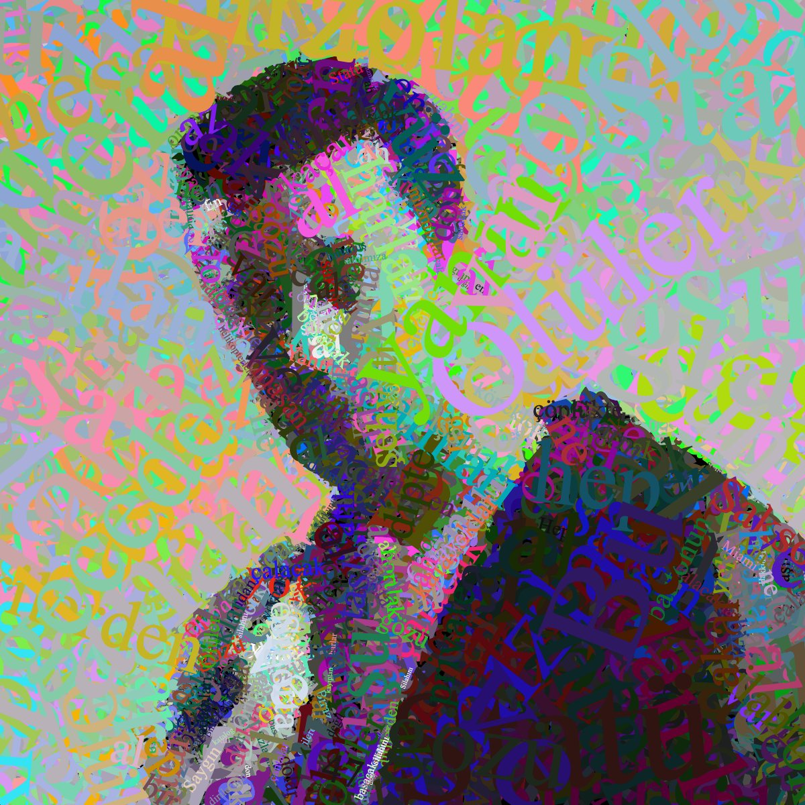
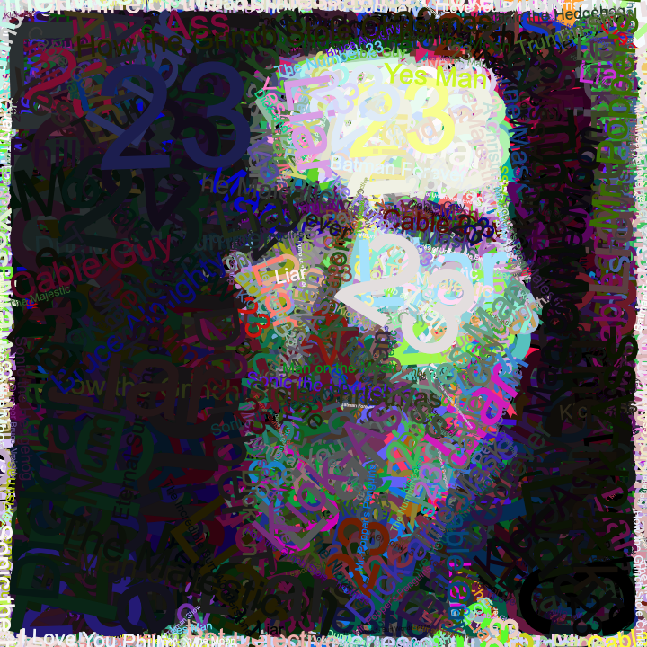
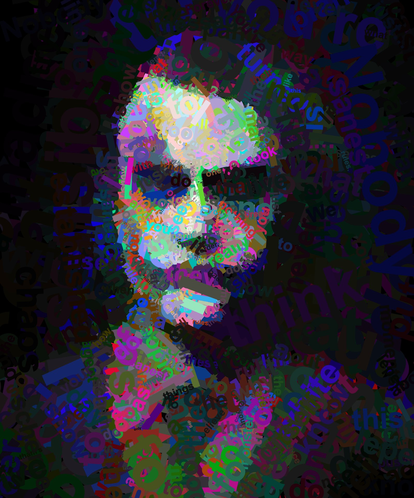

# Bedri

A web application that uses genetic algorithms to generate text-based art from images. The application creates artistic representations of images using text characters, with customizable parameters for font, size, and processing options.

## Examples

<table>
   <tr>
      <td>
         <a href="examples/1.jpeg">
            
         </a>
      </td>
      <td>
         <a href="examples/2.png">
            
         </a>
      </td>
      <td>
         <a href="examples/3.jpeg">
            
         </a>
      </td>
   </tr>
</table>

## Features

- Image upload and processing
- Customizable font settings (family, size, opacity, bold)
- Shadow effects for text
- Real-time processing with web workers
- Windows 95-inspired UI using React95
- Progress tracking and statistics
- Export functionality for generated images

## Technologies Used

- React
- TypeScript
- Vite
- React95 (Windows 95 UI components)
- Styled Components
- Web Workers for parallel processing

## Getting Started

### Prerequisites

- Node.js (v16 or higher)
- npm or yarn

### Installation

1. Clone the repository:
```bash
git clone https://github.com/yourusername/bedri.git
cd bedri
```

2. Install dependencies:
```bash
npm install
# or
yarn install
```

3. Start the development server:
```bash
npm run dev
# or
yarn dev
```

4. Open your browser and navigate to `http://localhost:5173`

### Building for Production

To build the project for production:

```bash
npm run build
# or
yarn build
```

The built files will be in the `docs` directory.

## Usage

1. Upload an image using the "Upload Image" button
2. Configure the processing settings:
   - Number of blocks
   - Font settings (family, size, opacity, bold)
   - Shadow effects
   - Number of iterations and generations
3. Click "Start Processing" to begin the genetic algorithm
4. Monitor the progress in real-time
5. Once complete, you can download the generated image

## Contributing

Contributions are welcome! Please feel free to submit a Pull Request.

1. Fork the repository
2. Create your feature branch (`git checkout -b feature/amazing-feature`)
3. Commit your changes (`git commit -m 'Add some amazing feature'`)
4. Push to the branch (`git push origin feature/amazing-feature`)
5. Open a Pull Request

## License

This project is licensed under the MIT License - see the [LICENSE](LICENSE) file for details.

## Acknowledgments

- [React95](https://github.com/React95/React95) for the Windows 95 UI components
- [Vite](https://vitejs.dev/) for the build tool
- [React](https://reactjs.org/) for the UI framework 